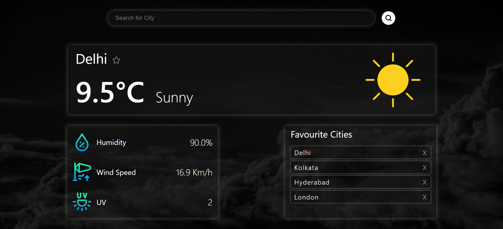

# Weather App

A simple weather app built using React that allows users to check the weather conditions for different cities.

🌦️ **Features**:
- Real-time weather data for cities worldwide.
- Detailed information including temperature, humidity, wind speed, and UV index.
- Save your favorite cities for quick access.
- Auto set to the user's current location.
- Beautiful weather icons for a visual representation.
  

🚀 **Technologies**:
- **React**: Fast, efficient, and dynamic web application.
- **React Toastify**: Modern notifications for a smooth user experience.
- **CSS**: Clean and stylish design.

📦 **Usage**:
1. Enter the name of the city you want to check the weather for.
2. Click "Search" or simply press Enter to retrieve the latest weather data.
3. Add and manage your favorite cities with ease.

🤝 **Contributing**:
We welcome contributions! Feel free to fork the repository, make your changes, and create a pull request. Let's make this Weather App even better together.

🌐 **Acknowledgments**:
- Weather data provided by [Weatherapi.com](https://www.weatherapi.com/).

**Author**
Himavarshith Reddy

Try it now. 🌤️

